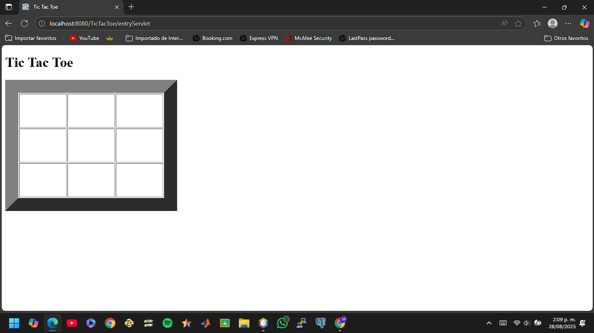

# TicTacToe

Este es un proyecto realizado en Java con NetBeans, que implementa el clásico juego del TicTacToe (Triki).  
El objetivo es desarrollar y desplegar una aplicación web en Java EE utilizando Eclipse, WildFly, Tomcat y Raspberry Pi, aplicando conceptos de control de versiones con GitHub y buenas prácticas en servidores de aplicaciones.

## Características
- Juego TicTacToe para dos jugadores.
- Implementado en Java.
- Código estructurado.

##  Ejemplo de ejecución

##  Autor
- Mateo Andrés Castaño Cabezas
